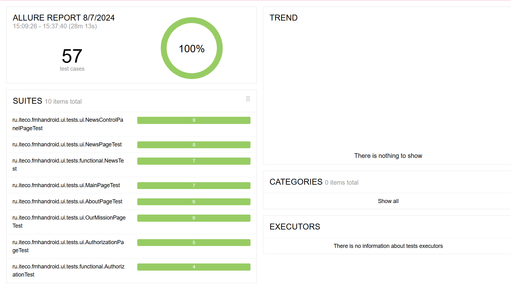

<h1>Отчёт автоматизированного тестирования</h1>
<h2>Краткое описание</h2>
В ходе автоматизации использовалась часть позитивных тест-кейсов, описанных в файле
<a href= "Cases.xlsx">Cases.xlsx</a>
, которые проверяют пользовательский интерфейс, основной функционал приложения, авторизацию. Задачей данного типа тестирования было автоматизировать наиболее часто проверяемые и приоритетные тест-кейсы.

<h2>Информация о процессе тестирования</h2>
В процессе проведения автоматизированного тестирования было реализовано 57 тест-кейсов. Из них:
<ul>
  <li>Успешно пройденных - 100%</li>
  <li>Неудачно пройденных - 0%</li>
  <figure>
    
    
  </figure>
</ul>

<h2>Результаты автоматизации</h2>
Реализован тест-кейс, отображающий ошибку, описанную в Issue 
<a href = "https://github.com/gulyolik/DiplomaProject/issues/3">
Сообщение отображает неверный текст, на странице авторизации, при вводе неверного логина или пароля.</a>.

